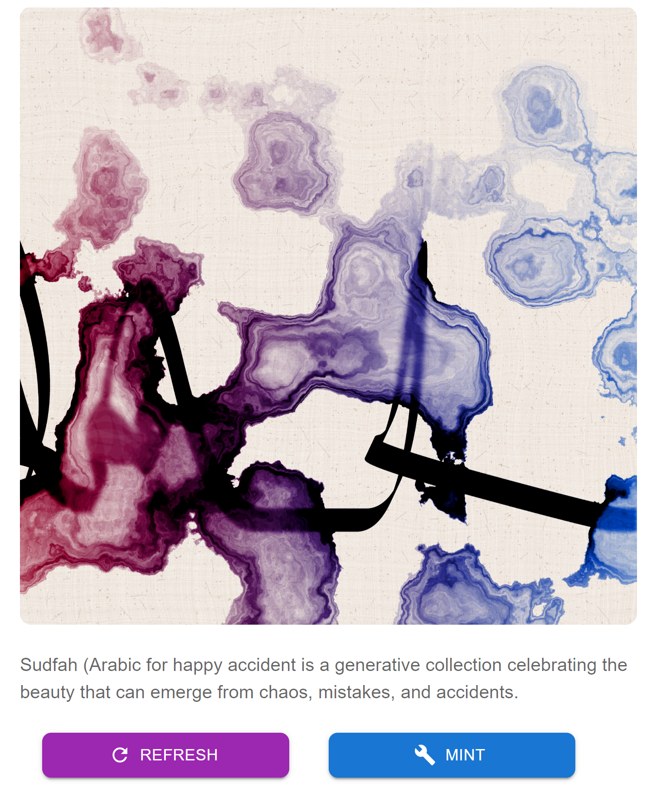
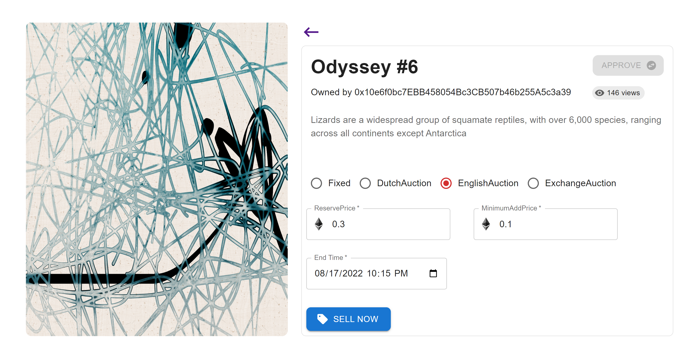
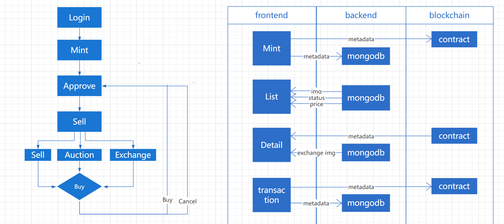

<div align="center">
  
 


</div>

- [介绍](#about)
- [总览](#preview)
- [构建](#technologies)
- [启动](#how-to-use)
- [TODO](#todo)

<a id='about'/>

## 介绍

去中心化NFT交易市场，在此进行自由的铸造和交易，支持多种交易模式，包括拍卖，以物换物等。

此合约部署在goerli测试链上。

http://43.142.34.153/

<a id='preview'/>

## 总览


<a id='architecture' />

## 交易

1. 铸造


点击Mint Your Art，选择NFT并MINT

2. 交易


点击卡片进入详情页，授权并选择交易模式。

- Fixed: 固定价格交易。
- DutchAuction: 荷式拍卖交易，设置起始价和地板价，根据拍卖结束时间每10分钟固定衰减一次。
- EnglishAuction: 英式拍卖交易，设置起始价和最低加价，拍卖终止后，点击成交自动和最高出价者完成交易，其余出价者金额返还。拍卖过程中卖主可以选择取消拍卖，取消后拍卖金额立即返回，非最高出价者也可以撤回金额。
- ExchangeAuction：以物换物模式(测试中)，出价者可以使用NFT出价交易，卖家从交换列表中选择，完成互换。拍卖过程中出价者可以随时撤回。


<a id='technologies'/>

## 构建

#### **Frontend** <sub><sup>React + TypeScript</sup></sub>
  - [React](https://pt-br.reactjs.org/)
  - [Axios](https://github.com/axios/axios)
  - [ethers.js](https://docs.ethers.io/v5/)
  - [Material UI](https://material-ui.com/pt/)

#### **Backend** <sub><sup>Express</sup></sub>
  - [Express](https://expressjs.com/pt-br/)
  - [MongoDB](https://www.mongodb.com/)
 
#### **Blockchain and Smart Contracts** <sub><sup>Solidity</sup></sub>
  - [Solidity](https://docs.soliditylang.org/)
  - [Hardhat](https://hardhat.org/)

<a id='how-to-use'/>

## 启动
### Requirements

* [Git](https://git-scm.com)
* [Node](https://nodejs.org/)
* [Yarn](https://yarnpkg.com/) or [npm](https://www.npmjs.com/)
* [Hardhat](https://hardhat.org/)

### run

- 合约
```bash
$ cd contract

# install the dependencies
$ yarn

# deploy de contracts on the blockchain
# add TEST_URL and PRIVATE_KEY in hardhat.config.ts
$ npx hardhat run scripts/deploy.js --network goerli
```

- 前端
```bash
$ cd frontend
$ yarn
$ yarn start
```

- 后端
```bash
$ cd backend
$ npm install
# add mongodb info 
$ node index.js
```

<a id='todo'/>

## TODO

1. 历史交易数据记录并展现
2. NFT views和favorites功能
3. NFT详情从后端载入部分数据，加快页面展示
4. 详情页渲染两次输入框问题


